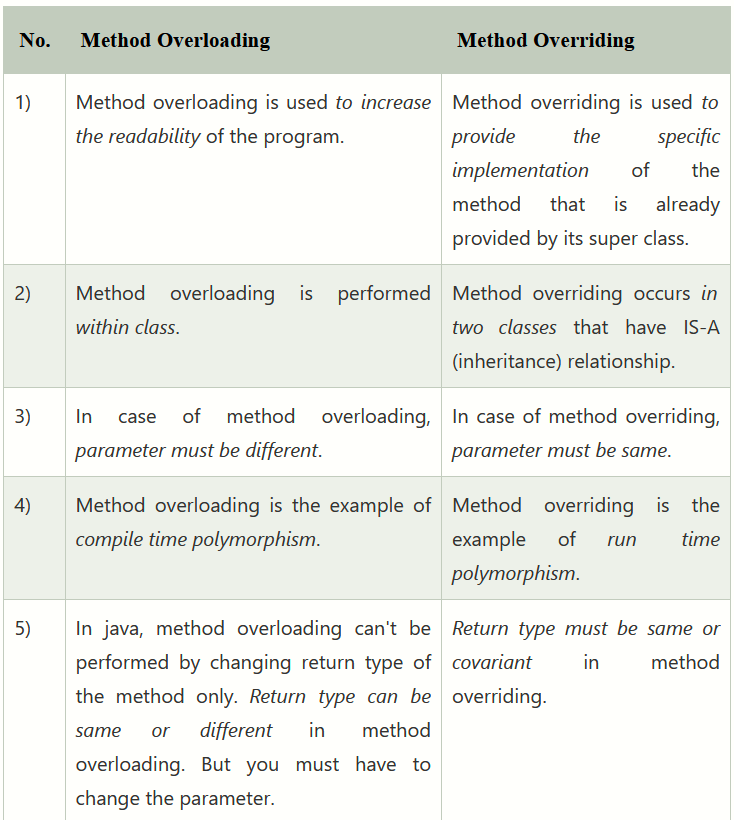

# <U> Inheritance </U>

Inheritance is a mechanism wherein a new class is derived from an existing class. In Java, classes may inherit or acquire the properties and methods of other classes. A class derived from another class is called a subclass, whereas the class from which a subclass is derived is called a superclass.

### Types of inheritance

Single inheritance - A class inherits properties from a single class.
Multilevel inheritance - A class inherits properties from a class which again has inherits properties.
Multiple Inheritance - Doesn't support in java directly.
Hierarchical Inheritance - more than one child class extends a single parent class.
Hybrid Inheritance - Doesn't support in java directly.

At first, we consider the Father class and Babu class.Here simply Babu class inherits Father class.So it is single inheritance.
If we consider Father class,Shohag class and ToaTalha class what we can see.ToaTalha class inherits from Shohag class and Shohag class is inherits Father class.That is the concept of multilevel inheritance.
Now we consider Father class,Shohag class and Babu class. here we can see, both Shohag class and Babu class inherits from Father class.So,it is the example of hierarchical inheritance.

### Advantages of Inheritance

    1. The main advantage of the inheritance is that it helps in reusability of the code. The codes are defined only once and can be used multiple times. In java we define the super class or base class in which we define the functionalities and any number of child classes can use the functionalities at any time.
    2. Through inheritance a lot of time and efforts are being saved.
    3. It improves the program structure which can be readable.
    4. The program structure is short and concise which is more reliable.
    5. The codes are easy to debug. Inheritance allows the program to capture the bugs easily.
    6. Inheritance makes the application code more flexible to change.
    7. Inheritance results in better organisation of codes into smaller, simpler and simpler compilation units.

### Disadvantages of Inheritance

    1. The main disadvantage of the inheritance is that the two classes(base class and super class) are tightly coupled that is the classes are dependent on each other.
    2. If the functionality of the base class is changed then the changes have to be done on the child classes also.
    3. If the methods in the super class are deleted then it is very difficult to maintain the functionality of the child class which has implemented the super class’s method.
    4. It increases the time and efforts take to jump through different levels of the inheritance.

# <u> Polymorphism </u>

Polymorphism means "many forms", and it occurs when we have many classes that are related to each other by inheritance.

### Overloading and Overriding

When two or more methods in the same class have the same name but different parameters, it's called Overloading. When the method signature (name and parameters) are the same in the superclass and the child class, it's called Overriding.

In Shohag class.there are two methods in the same name but differnt parameters.When we call the method with parameter then compiler recognise at compile time.And call the method that has parameters.Here method overloading occurs.Overloading also called compile time polymorphism.

If we consider Father class and Shohag class, there are the same signature of a method.In Main class, we assign Shohag class in an object of Father class.Then we call the method that was the same signature.
What happened!😯😯
Shohag class's method called!!
Doesn't worry.I have cleared.when it compile Father class simply find the method in his class.But when the program run then call the child class's method.As decision has been changed in run time.Thats why it is overriding.It's also called run time polymotphism.

### Difference between overloading and overriding

